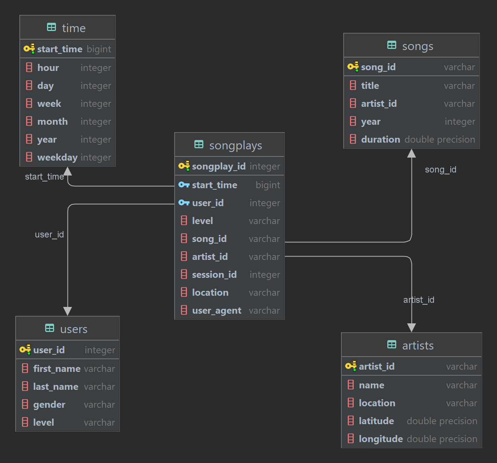

# 1. Discuss the purpose of this database in the context of the startup, Sparkify, and their analytical goals.

The purpose of this database is to get the analytical data about music and their related information to get to know more about their artists and users such as:
- Which song is played the most?
- The artist that has the song which is played the most. This metric can be used to award that artist.
- Collection of songs that are played the most for a user for each year.
- How many paid and free users?
- How many users? The ratio of male and female users?

# 2. State and justify your database schema design and ETL pipeline.

## 2.1 Schema design

The schema design is followed by the guide in project instructions, including 1 fact table and 4 dimension tables and have the schema like below:

## 2.2 ETL pipeline steps

### 2.2.1 General
1. Read configuration file
2. Create spark session

### 2.2.2 Create songs and artists table
1. Read songs data from S3
2. Extract songs data into songs table and drop duplicates songs
3. Create global temporary view for songs table (this will use later to find songs_id to create songplays table)
4. Write songs table to S3, partitioned by year and artist_id. Because when we use `partitionBy` command, the data file when write to S3 will be removed those partitioned columns, so to avoid this, we clone the same columns for partitioned columns.
5. Extract data from songs data into artists table, rename columns, drop duplicates artists, group data by artist_id, order by year descending and get the first row to ensure the latest information about artist (like location) is extracted.
6. Write artists table to S3.
7. Create global temporary view for artists table (this will use later to find artist_id to create songplays table).

### 2.2.3 Create users, time and songsplay table
1. Read log data from S3.
2. Filter log data by page = 'NextSong'.
3. Extract data from log data into users table, rename columns, drop duplicates users, group data by user_id, order by ts (timestamp) descending and get the first row to ensure the latest information about user (like level) is extracted.
4. Write users table to S3.
5. Add timestamp column to log data using udf function and convert ts column to timestamp type.
6. Add datetime column to log data using udf function and convert ts column to string type in datetime format.
7. Create udf functions to extract information from timestamp column: hour, day, month, year, week, weekday.
8. Create time table from log data using datetime column and udf functions to extract data from timestamp column.
9. Write time table to S3, partitioned by year and month, use the same clone technique to avoid columns being removed.
10. Create songs dataframe with song_id, artist_id, and duration by joining song and artist tables.
11. Create songplays table from log data join with songs dataframe and time table.
12. Write songplays table to S3, partitioned by year and month.

# 3. [Optional] Provide example queries and results for song play analysis.

- Which song is played the most: `select song_id, count(*) total_played from songplays group by song_id order by total_played desc;`
- The artist that has the song which is played the most: `select artist_id, song_id, count(*) total_played from songplays group by song_id, artist_id order by total_played desc;`